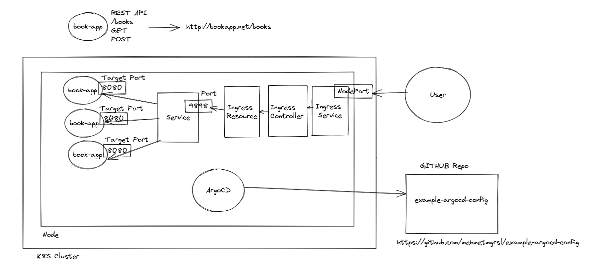

### Install minikube
https://minikube.sigs.k8s.io/docs/start/

### Install ArgoCD in k8s cluster
kubectl create namespace argocd

kubectl apply -n argocd -f https://raw.githubusercontent.com/argoproj/argo-cd/stable/manifests/install.yaml

### Access ArgoCD UI
kubectl get svc -n argocd

kubectl port-forward svc/argocd-server 8181:443 -n argocd

http://localhost:8181

### Login with admin user and below token:
kubectl -n argocd get secret argocd-initial-admin-secret -o jsonpath="{.data.password}" | base64 --decode; echo

### You can update init password
argocd login localhost:8181

argocd account update-password

###  Demo

### Links
Config repo: https://github.com/mehmetmgrsl/example-argocd-config

Book app: https://github.com/mehmetmgrsl/example-book-app

Docker repo for the book app: https://hub.docker.com/r/mgrsl/example-book-app/tags

Install ArgoCD: https://argo-cd.readthedocs.io/en/stable/getting_started/#1-install-argo-cd

Login to ArgoCD: https://argo-cd.readthedocs.io/en/stable/getting_started/#4-login-using-the-cli

ArgoCD Configuration: https://argo-cd.readthedocs.io/en/stable/operator-manual/declarative-setup/